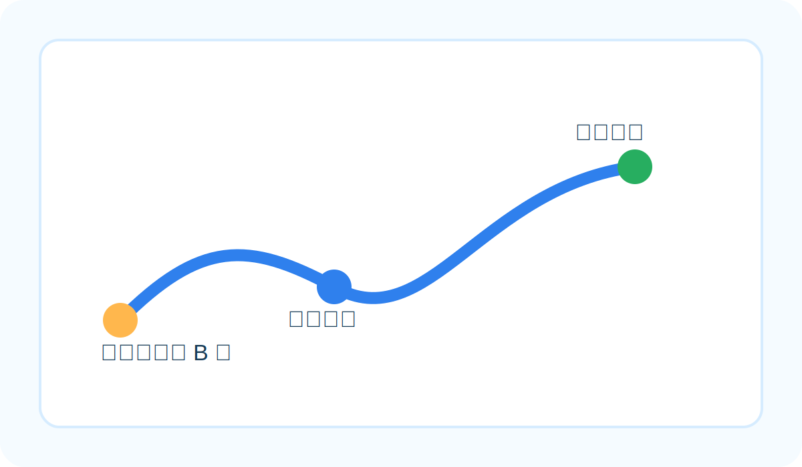

# 本次想做什么

这次行动希望在不打扰现场工作节奏的前提下，把基础饮水补给送到更靠近一线的位置。

## 节点安排

- 集合时间：14:00（UTC+8）
- 集合地点：天通苑东站 B 口
- 行动方式：轻装步行进入目标区外围

## 执行提醒

- 不摆拍，不要求他人配合镜头
- 先保证补给动作顺畅，再做记录
- 参与者可根据体力与时间灵活调整

## 志愿者整体安排

- 志愿者参与后，可登记志愿北京时长记录
- 发水完成后，会转入一段轻徒步，路上继续交流路线和现场观察
- 徒步过程中可以安排桌游、桌布、飞盘等轻互动活动
- 徒步结束后，会到地铁站附近再看大家要不要一起约饭
