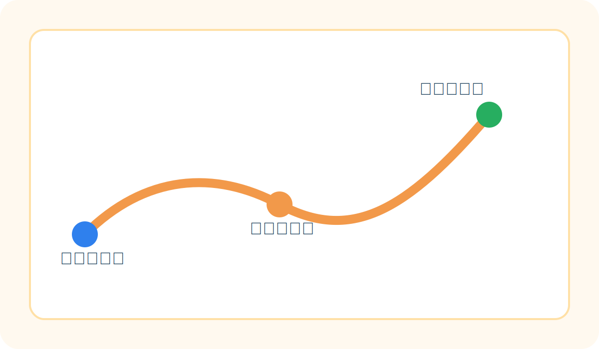

# 本次关注重点

希望验证更远节点下的补给效率，并补充天气、时间段和人流变化的观察。

## 待确认事项

- 是否安排第二组协同行动
- 是否加入自行车接力节点
- 是否同步记录天气与体感温度

> 如果天气变化较大，本次行动将调整为更小规模的试运行。

## 志愿者整体安排

- 志愿者可登记志愿北京时长记录
- 发水结束后，会安排一段延展线路徒步，继续熟悉周边地形
- 徒步过程中可根据现场情况安排桌游、桌布、飞盘等轻活动
- 活动收尾后，会到地铁站附近再看大家是否一起约饭
