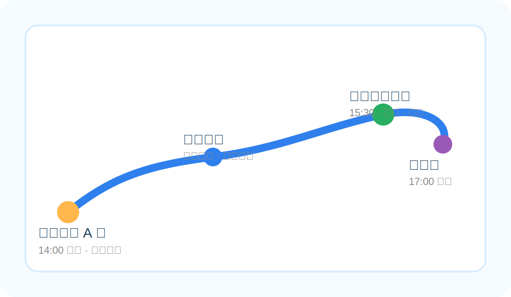

# 本次想做什么

这是一场关于城市律动、随机善意与自我修复的流动实验。我们从北京最繁忙的"菜篮子"出发，带着烟火气，走向南苑的荒野绿洲。

## 节点安排

- **14:00 | Init** — 新发地站 A 口集合，进入农贸市场采购时令水果，装满环保袋
- **14:15–15:30 | Flow** — 徒步路径：新发地 → 南苑湿地，沿途随机补给建筑工人
- **15:30–17:00 | Rest** — 南苑湿地二期草坪，展开坐垫，开桌游，甩飞盘
- **17:00 | Log** — 和义站收尾，清理垃圾，记录落日，系统回归离线

## 装备准备

- 24 瓶水 + 砂糖橘 / 小番茄 + 环保分装袋
- 多人户外坐垫（建立临时据点）
- 北京 3 月风大，请准备防风外套保护体温

## 执行提醒

- 不摆拍，不要求他人配合镜头
- 补给动作轻量，点头示意，不打扰工人节奏
- 参与者可根据体力与时间灵活调整

## 志愿者整体安排

- 志愿者参与后可登记志愿北京时长记录
- 补给完成后转入南苑湿地轻徒步，释放多巴胺
- 草坪阶段可安排桌游、飞盘等轻互动活动
- 活动收尾后至和义站附近，再看大家要不要一起约饭

> 目前还缺 3 个组件（搭子），想来的私信或评论区见。不设限，不内耗。
